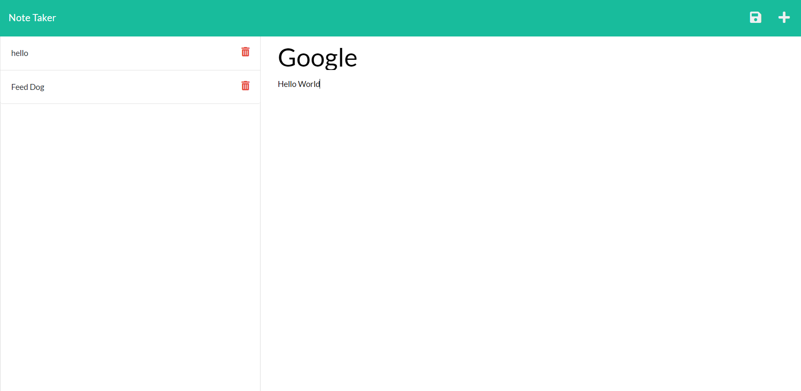

# Express.js Note Taker 
[](https://opensource.org/licenses/MIT)

## Description
A full stack project, that utilizes express to pull data from the client side and store it in a JSON file, and send the data back to update the web application

## Table of Contents
- [Installation Instructions](#installation-instructions)
- [Usage Information](#usage-information)
- [Contribution Guidelines](#contribution-guidelines)
- [Test Instructions](#test-instructions)
- [Questions](#questions)
- [Video](#video)

## Installation Instructions
```
npm i
```

## Usage Information
open source

## Contribution Guidelines
n/a

## Test Instructions
```
npm start
```

## License
This project is licensed under the terms of the [MIT](https://opensource.org/licenses/MIT) license

## Website


Link to website
[Note Take Web App](https://tranquil-woodland-59466.herokuapp.com/)

## Questions
My Github Profile: [cluck135](https://github.com/cluck135)

Email me your questions at: [casenluck@gmail.com](mailto:casenluck@gmail.com)

